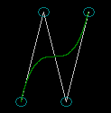

# Bezier curve in Computer Graphics.
# Requires [Graphics](https://github.com/ahuynh359/Graphics)
## Supports: Win x86.

## Implemented:
* Calculation of Bezier curve of n-th order.
* Printing it on screen using graphics.h.
* Geometrical transofmations: rotation, scaling, translation, reflection.
* Basic menu.

## Output examples: 
### 3th degree curve: 

### 4th degree curve:
 
### 5th degree curve:

### 90 degree rotation: 

